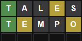

# WSS - Wordscapes Solver

[](https://github.com/johnmcfarlane/wss/actions/workflows/test.yml)

## Introduction

Wordscapes Solver is a collection of word puzzle solvers written in C++.
It serves two purposes:

1. To help users find words in games such as
   * [Wordle](https://www.powerlanguage.co.uk/wordle/),
   * [Wordscapes](https://www.peoplefun.com/games),
   * [Words With Friends](https://www.zynga.com/games/words-with-friends-2/) and
   * [Scrabble](https://scrabble.hasbro.com).

1. To provide the template for a modern C++ project.

## Word Search

WSS is a collection of command-line tools which produce solutions to problems
posed by English-language word games. For example, _rack_ is useful for finding
words that might be valid moves in the game of Wordscapes.

WSS builds the tools by first consuming a number of lexicons,
converting them into C++-encoded data,
and then using them in programs which solve game-specific problems.

The data structures are a Directed Acyclic Word-Graph (DAWG),
similar to the one described in the paper,
[The World's Fastest Scrabble Program](https://www.cs.cmu.edu/afs/cs/academic/class/15451-s06/www/lectures/scrabble.pdf)
(Andrew W. Appel, Guy J. Jacobson, 1988).
It allows the tools to search through the lexicon in a way that avoids much of
the duplication one typically finds in a word list.
This helps to find solutions in a shorter time.

## Versatility Through Simplicity

WSS also aims to demonstrate a simpler way of organising C++ projects.

Many CMake projects employ a 'kitchen sink' approach to scripting,
braking the rules of good engineering by trying to make a single tool perform
many tasks. The result is often complex and brittle.

WSS makes effective use of CMake and Conan by keeping configuration
scripts minimal, declarative and decoupled. In this way, the code can be
configured, built and tested against the widest variety of compilers, analysers
and other development tools.

Multiple CMake targets and thousands of lines of code are presented here.
Yet, the essential configuration amounts to a 15-line conanfile and
168 lines of CMake that can be built and tested with just two commands.
This is possible because the build system is separate
from other aspects of project management, such as toolchain configuration and
dependency management. It does one thing well: describing binaries.

## Continuous Integration

The project's CI pipeline demonstrates how to maintain high-quality C++ by
running automated tests against tools such as:

* [AddressSanitizer](https://clang.llvm.org/docs/AddressSanitizer.html),
* [CppCheck](http://cppcheck.net/) static analyser,
* [Clang](https://clang.llvm.org/) and [GCC](https://gcc.gnu.org/) compilers,
* [Clang Static Analyzer](https://clang-analyzer.llvm.org/),
* [Clang-Tidy](https://clang.llvm.org/extra/clang-tidy/) C++ linter and static
  analyser,
* [pre-commit](https://pre-commit.com/) linting framework with
  formatting and correctness checks for:
  * Bash
  * C++
  * CMake
  * JSON
  * Markdown
  * Python
  * YAML
* [UndefinedBehaviorSanitizer](https://clang.llvm.org/docs/UndefinedBehaviorSanitizer.html).
* [Valgrind](https://valgrind.org).

Developers are invited to suggest or add their favourite tools,
or to use this project as the starting point for their own C or C++ projects.

## Instructions

WSS is built and tested on Linux.
It is designed to be easy to build and to run with:

* Conan package manager,
* CMake build system generator,
* A C++20-compatible GCC or Clang compiler.

### Build and Test

To generate an example word list using the _rack_ program

1. create an empty build directory,

   ```sh
   mkdir -p build
   cd build/
   ```

1. install package dependencies,

   ```sh
   conan install --build=missing <path-to-wss>
   ```

1. then configure, build, test and install the programs:

   ```sh
   conan build <path-to-wss>
   ```

The programs are now in the _package/bin/_ directory.

### Run Wordle

The _package/bin/wordle_ program suggests words to play in Wordle. For example,
after playing the following two moves,



you can search for possible WORDLEs:

```sh
package/bin/wordle TALES20010,TEMPO21001
```

Output:

> THROE  
> TOGUE  
> TONNE  
> TOQUE  
> TORTE  
> TOWIE  
> TRODE  
> TROKE  
> TRONE  
> TROVE  
